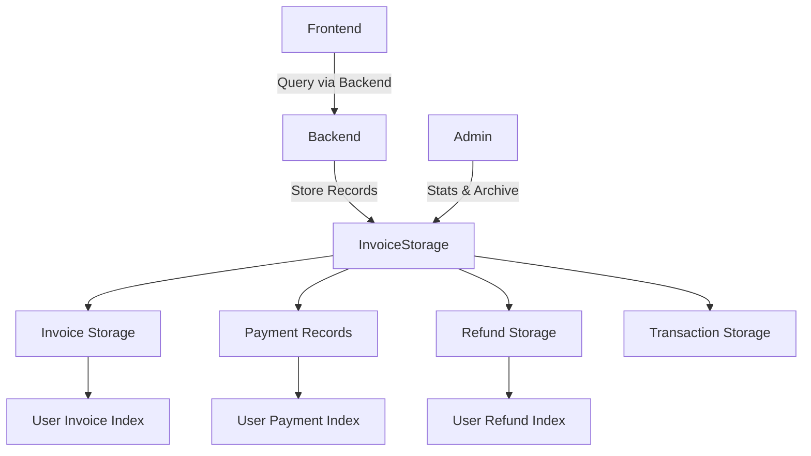

# InvoiceStorage Architecture - ICTO V2

## Overview
InvoiceStorage is a dedicated external canister responsible for storing payment records, invoices, refunds, and transaction data, following the same architectural pattern as `audit_storage`. This separation reduces the backend canister's storage burden and improves upgrade performance.

## Core Principles
- **External Storage Pattern**: Dedicated canister for payment/invoice data
- **Whitelist Security**: Only authorized canisters can write data
- **User-Indexed Queries**: Efficient retrieval by user ID
- **Upgrade Safety**: Proper stable variable management
- **Data Archiving**: Automatic cleanup of old records

## Directory Structure
```
invoice_storage/
├── main.mo              # Main actor with storage functions
├── types/
│   └── Types.mo         # Invoice, Payment, Refund types
└── ARCHITECTURE.md      # This file
```

## Service Architecture

### Core Data Types
- **Invoice**: Complete billing information with status tracking
- **PaymentRecord**: Individual payment transactions with blockchain data
- **Refund**: Refund requests and processing status
- **PaymentTransaction**: Blockchain transaction details

### Storage Architecture


### Data Flow

#### 1. Payment Record Creation
```
Backend Payment → InvoiceStorage.createPaymentRecord()
                → Store record + Update user index
                → Return record ID
```

#### 2. Invoice Management
```
Backend Service → InvoiceStorage.createInvoice()
                → Store invoice + Update user index
                → Return invoice ID
```

#### 3. User Queries
```
User Request → Backend → InvoiceStorage.getUserPaymentRecords()
             → Filter by user ID → Return paginated results
```

## Performance & Scalability

### Storage Efficiency
- **Payment Record**: ~2.6KB per record
- **Invoice**: ~1.5KB per invoice
- **Refund**: ~1.2KB per refund
- **Total per active user**: ~5.3KB (removed from backend)

### Query Performance
- **User-indexed access**: O(1) user lookup
- **Paginated results**: Configurable limit/offset
- **Trie-based storage**: Efficient memory usage

### Scaling Capabilities
- **Current capacity**: 50,000+ payment records
- **Archive support**: Automatic cleanup of old data
- **Independent scaling**: Separate from backend upgrade cycles

## Security Architecture

### Access Control
- **Whitelist-based**: Only authorized canisters can write
- **Controller access**: Full admin privileges for controllers
- **Query restrictions**: Callers must be whitelisted

### Data Protection
- **Immutable records**: Payment data cannot be modified after creation
- **Audit trail**: All operations are logged
- **Backup support**: Export functionality for disaster recovery

## Integration Points

### Backend Integration
```motoko
// Backend calls InvoiceStorage for payment record creation
let invoiceStorage = actor("canister-id") : InvoiceStorageInterface;
let result = await invoiceStorage.createPaymentRecord(record);
```

### Admin Functions
- `getInvoiceStats()`: System-wide payment statistics
- `archiveOldRecords()`: Cleanup old data
- `exportData()`: Backup functionality

## API Endpoints

### Payment Records
- `createPaymentRecord(record)`: Store new payment
- `updatePaymentRecord(id, record)`: Update existing payment
- `getPaymentRecord(id)`: Retrieve specific payment
- `getUserPaymentRecords(userId, limit, offset)`: User's payments

### Invoices
- `createInvoice(invoice)`: Store new invoice
- `updateInvoice(id, invoice)`: Update existing invoice
- `getInvoice(id)`: Retrieve specific invoice
- `getUserInvoices(userId, limit, offset)`: User's invoices

### Refunds
- `createRefund(refund)`: Store new refund
- `updateRefund(id, refund)`: Update existing refund
- `getRefund(id)`: Retrieve specific refund
- `getUserRefunds(userId, limit, offset)`: User's refunds

## Future Enhancements

### Phase 1 (Immediate)
- [ ] Basic CRUD operations for all record types
- [ ] User-indexed queries
- [ ] Whitelist security

### Phase 2 (Month 1)
- [ ] Advanced filtering and search
- [ ] Batch operations
- [ ] Data compression

### Phase 3 (Month 2-3)
- [ ] Multi-canister sharding
- [ ] Real-time notifications
- [ ] Analytics and reporting

## Migration Strategy

### From Backend Storage
1. **Dual-write period**: Write to both backend and InvoiceStorage
2. **Data migration**: Transfer existing records
3. **Switch-over**: Route all reads to InvoiceStorage
4. **Cleanup**: Remove payment data from backend

### Backward Compatibility
- Backend APIs remain unchanged
- Gradual migration of query endpoints
- Fallback to backend for missing data during transition

## Operational Procedures

### Deployment
```bash
# Deploy InvoiceStorage canister
dfx deploy invoice_storage

# Add backend to whitelist
dfx canister call invoice_storage addToWhitelist '(principal "backend-canister-id")'
```

### Monitoring
- Health checks every 5 minutes
- Storage capacity monitoring
- Query performance metrics

### Maintenance
- Monthly data archiving
- Quarterly capacity planning
- Annual security review

## Error Handling

### Common Errors
- `Unauthorized`: Caller not whitelisted
- `NotFound`: Record doesn't exist
- `StorageFull`: Canister capacity exceeded

### Recovery Procedures
- Automatic retry with exponential backoff
- Fallback to backend storage during outages
- Manual data recovery from exports

---

**Last Updated**: Implementation Date  
**Version**: 1.0.0  
**Maintainer**: ICTO V2 Development Team 