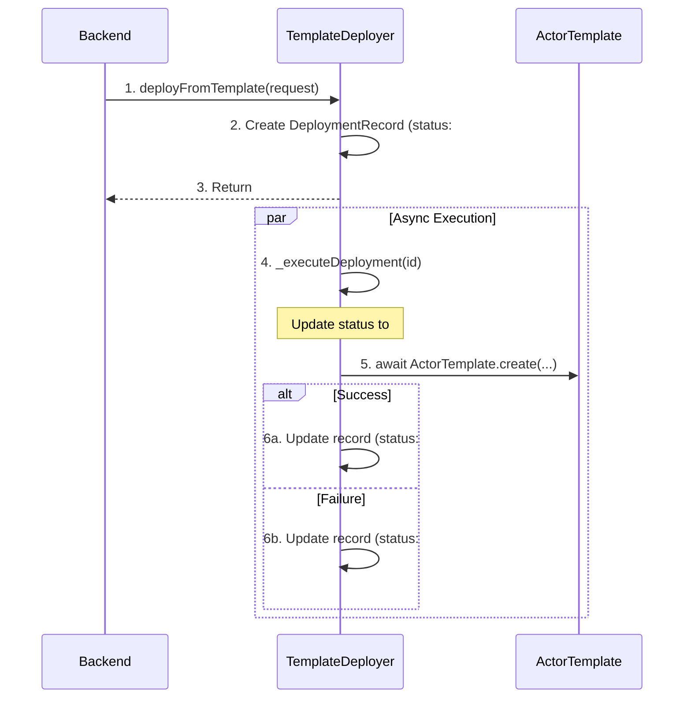

# Template Deployer Architecture - ICTO V2

## 1. Overview

**Purpose:** The `template_deployer` is a standardized, unified canister responsible for deploying new canisters from a predefined set of Motoko actor class templates. It acts as a generic "factory" for common, low-risk services like vesting contracts (Locks), DAOs, distribution pools, and launchpads.

**Core Principle:** This canister follows the **"Robust Asynchronous Factory Pattern"**. It centralizes the deployment logic, records every deployment attempt, and includes a pending/retry mechanism to ensure atomicity and prevent inconsistent states. It is designed to be called exclusively by the central `backend` canister.

**Key Responsibilities:**
- Receive a standardized deployment request from the `backend`.
- Create a persistent `DeploymentRecord` to track the entire lifecycle.
- Return a `PendingId` to the `backend` immediately.
- Asynchronously execute the deployment by instantiating the correct actor class.
- Update the `DeploymentRecord` with the result (`canisterId`) or error message.
- Provide admin functions to query deployment status and retry failed deployments.

---

## 2. Service Architecture

### 2.1 Core Function: `deployFromTemplate`

The entry point is now asynchronous and robust against failures.

**Flow Diagram:**

### 2.2 Data Types and Interfaces

- **`DeploymentRecord`**: The source-of-truth for every deployment. It stores the request payload, status, result, and timestamps.
- **`DeploymentError`**: A structured error type. The `#Pending(id)` variant is the expected "successful" response for the initial call, allowing the `backend` to track the async process.

### 2.3 Security and Robustness

- **Atomicity:** The two-phase (request -> execute) flow prevents race conditions. A failure during the async execution can be safely recovered from.
- **Persistence:** All `DeploymentRecord`s are stored in a stable `Trie`, ensuring they survive canister upgrades.
- **Traceability:** Storing the full request payload allows for complete audit trails and easy debugging.
- **Admin Recovery:** Admins can query the state of any deployment and manually trigger a retry for failed deployments using `adminRetryDeployment`.

---

## 3. How to Extend (Adding a New Template)

The extension process remains simple:

1.  **Create Template:** Add the `new_template.mo` actor class file to the `/templates` directory.
2.  **Update Types (`Types.mo`):**
    - Add `#NewTemplate` to the `DeployerType` enum.
    - Add a new `NewTemplateConfig` type and add it to the `DeployConfig` variant.
3.  **Update Main Logic (`main.mo`):**
    - Import the new `NewTemplate`.
    - Add a `case (#NewTemplate)` to the `switch` statement in `_executeDeployment` that calls `NewTemplate.create(...)`.
4.  **Update Backend:** Add a new public function `deployNewTemplate(...)` to the central `backend` canister that calls the unified deployment flow.
5.  **Deploy:** The `template_deployer` is now ready to deploy the new contract type with the full pending/retry safety mechanism.
